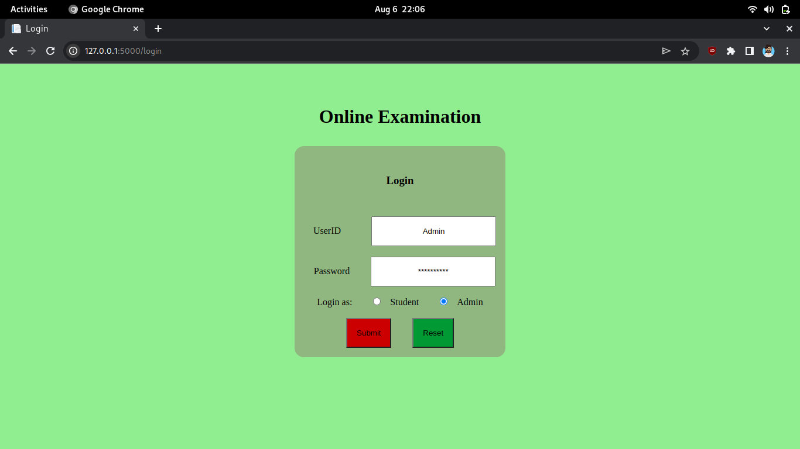
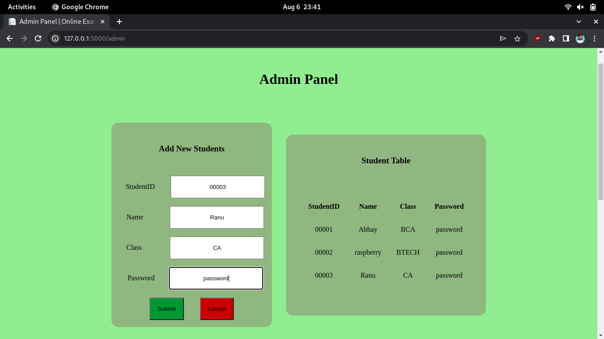
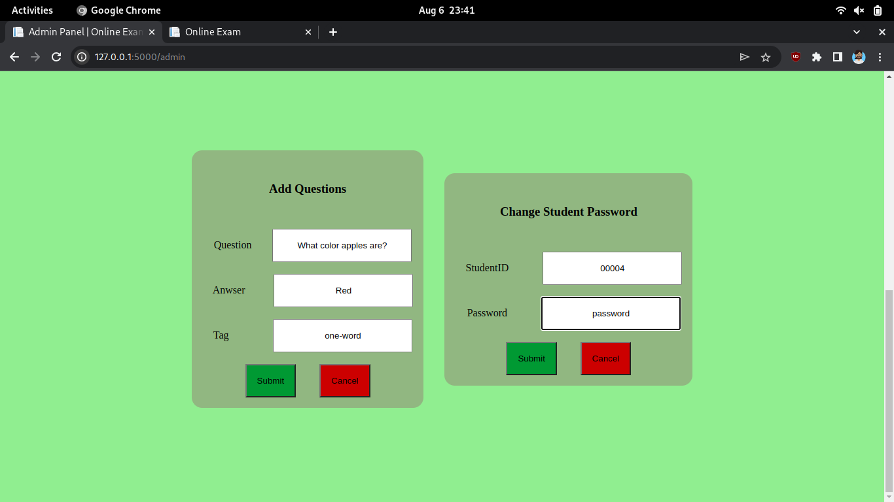
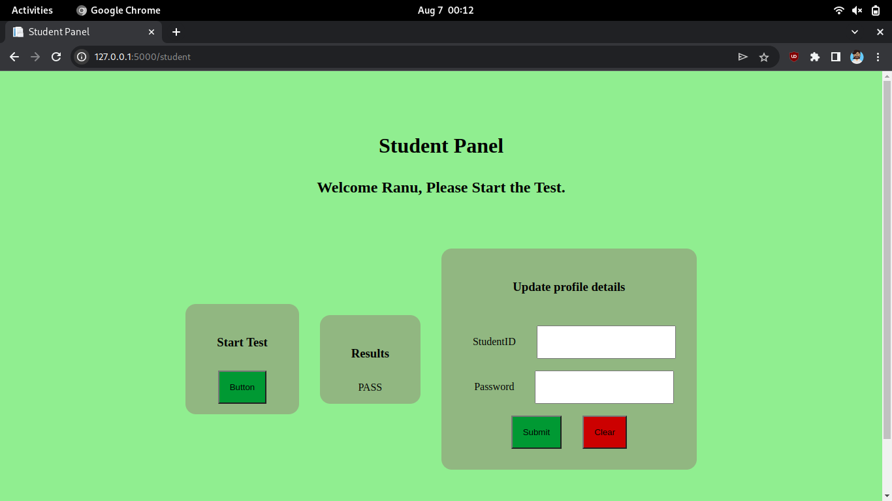
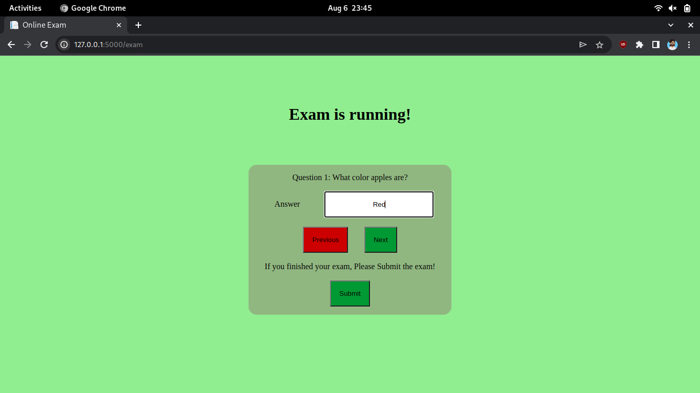

## Online-EXAM

Integrated Login Page

After admin login Admin panel is open.

Here we can add student and see how many students are in the database with their class so that exam can be scheduled.

In this we can add Questions, Tags, and Change Password.

This is student Tab here student can check results and start the test and even.

This is exam page where questions are displayed.
